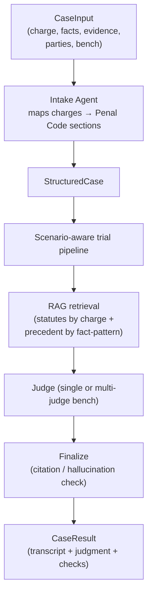
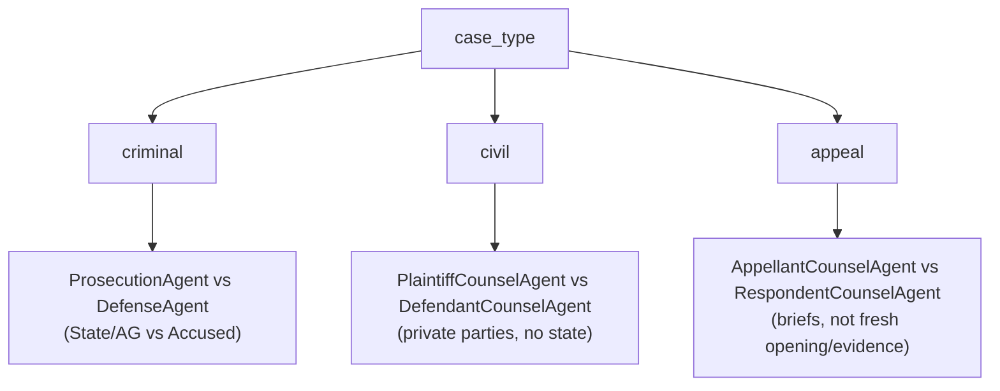
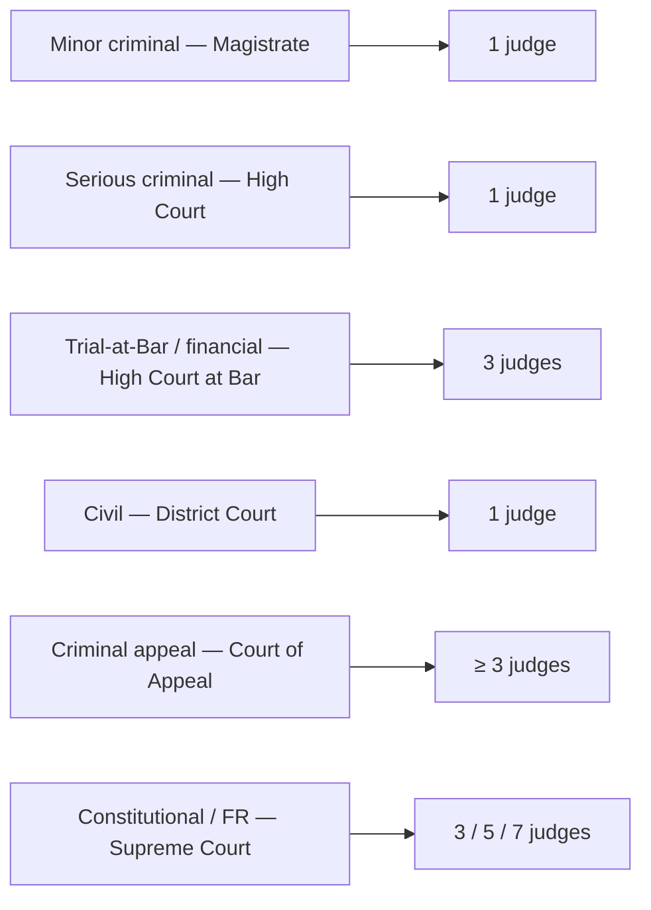
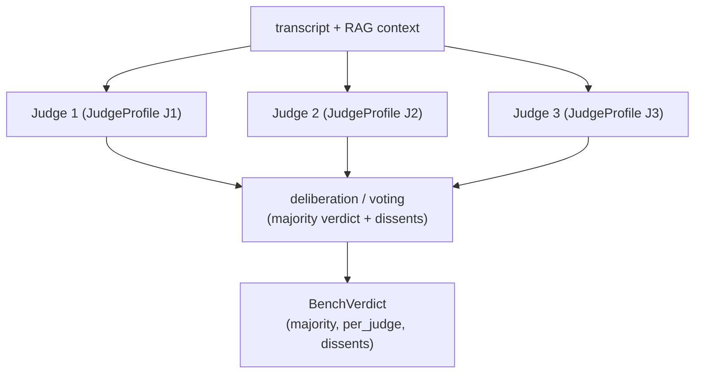
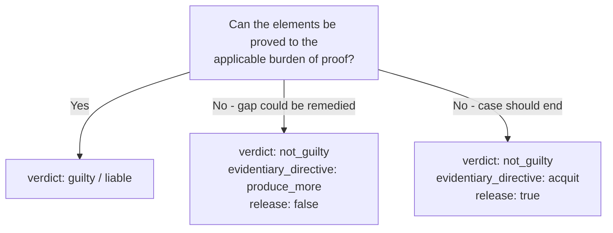
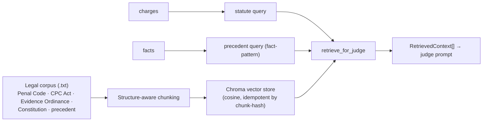
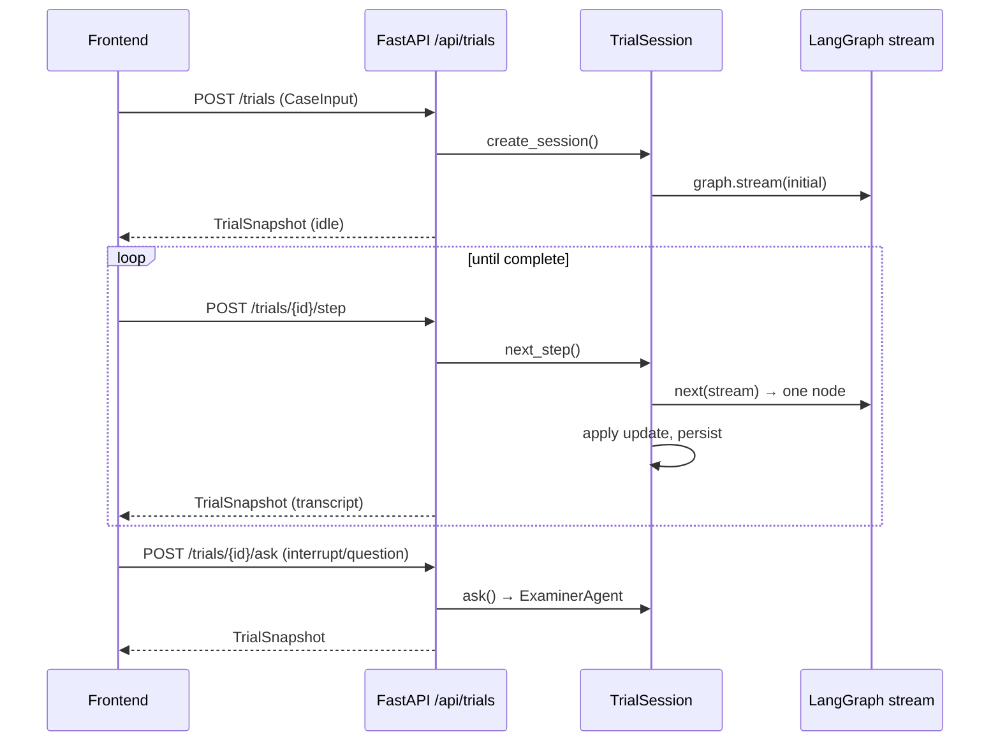
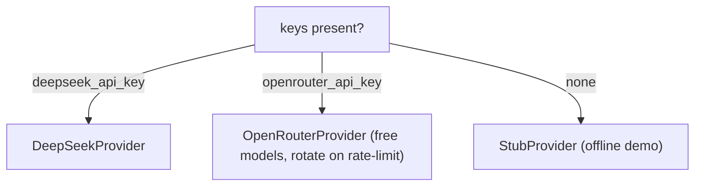
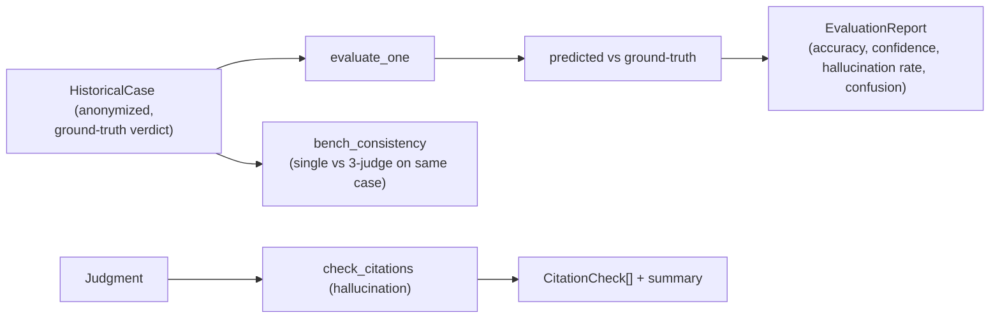

# AI Judge — Backend Workflow & Graph (Mermaid)

This document describes the **backend logic** of AI Judge end to end: the LangGraph
state machine, node-by-node flow, the scenario-aware routing, multi-judge deliberation,
the RAG pipeline, and the verdict model. All diagrams are Mermaid (rendered on GitHub).

> **Status:** research/educational simulation. Not a deployable adjudication system.

---

## 1. Top-level pipeline



---

## 2. The LangGraph state machine

The whole trial is a single `StateGraph` in `app/graph/trial.py`. Each node is one
distinct LLM call with its own role system-prompt. `TrialState` is the shared dict.


The transcript channel uses a **reducer** so nodes append, never overwrite:

```python
def _append_turns(existing, update):
    return (existing or []) + (update or [])
```

### `TrialState` fields

| key | type | purpose |
|-----|------|---------|
| `case_input` | `CaseInput` | raw input |
| `case` | `StructuredCase` | intake output |
| `transcript` | `list[TranscriptTurn]` | accumulated, reducer-merged |
| `prosecution_opening` … `defense_closing` | `str` | per-stage outputs |
| `retrieved_context` | `list[RetrievedContext]` | RAG hits for the judge |
| `judgment` | `Judgment` | parsed verdict (+ directive) |
| `bench_judgments` | `list` | per-judge judgments (bench) |
| `result` | `CaseResult` | final envelope + citation checks |
| `_llm`, `_settings` | internal | provider + settings |

---

## 3. Scenario-aware routing (`case_type`)

The node set is chosen by `case_type` and the `bench`. Sri Lanka follows the common-law
model: the **State/AG prosecutes** (victim is a witness, not a party); civil disputes are
private parties; appeals are appellant vs respondent.



Routing is centralized in `counsel_for(case_type, side)` (`app/agents/litigants.py`).

### Bench sizes by scenario



---

## 4. Multi-judge bench deliberation

When `len(bench) > 1`, the single `judge` node becomes **N parallel Judge Agent calls**
(each sees the same transcript + RAG context, differing only by `JudgeProfile`) followed by
a **deliberation / voting node** that returns a **majority verdict** and records dissent.



`_aggregate_bench` tallies per-judge verdicts, picks the majority, and records which
judges dissented. The `evidentiary_directive` is aggregated by most-common non-empty value.

---

## 5. Verdict model (binary + directive)

Verdicts are **binary** — `guilty`/`not_guilty` (or `liable`/`not_liable`). There is no
`insufficient_evidence`. When the record is insufficient the judge returns `not_guilty`
plus an `evidentiary_directive`:



The parser normalises any legacy `insufficient_evidence` to `not_guilty + produce_more`.

---

## 6. RAG pipeline



- **Chunking:** statutes by `s.N:`; judgments by `Facts/Issues/Reasoning/Held`; constitution
  by `Article N:`.
- **Retrieval:** statutes keyed to the charge (`CHARGE_HINTS`), precedent by fact similarity.
- **Limitation:** fact-pattern similarity ≠ stare decisis (ratio decidendi).

---

## 7. Stepped "live hearing" loop

The demo player runs the same graph one node at a time using LangGraph
`stream(stream_mode="updates")` (`app/graph/session.py`). Pausing = not calling
`next_step()`; each step persists to `data/runs/`.



---

## 8. LLM provider selection



Free-model rotation in `OpenRouterProvider.complete()` tries each model in `free_models`
until one responds (handles per-model daily rate limits).

---

## 9. Evaluation & correctness



---

## 10. API surface (`app/api/routes.py`)

| Method | Path | Purpose |
|--------|------|---------|
| GET | `/api/health` | health + active LLM provider |
| GET | `/api/scenarios` | list Sri Lankan scenario templates |
| GET | `/api/scenario/{key}` | concrete scenario `CaseInput` |
| GET | `/api/seed-case/{key}` | legacy seed case |
| POST | `/api/cases/run` | one-shot full trial |
| POST | `/api/trials` | start stepped session |
| GET | `/api/trials/{id}` | session state |
| POST | `/api/trials/{id}/step` | execute next node |
| POST | `/api/trials/{id}/ask` | judge/counsel asks a question |
| GET | `/api/trials/{id}/scene` | scene narration |
| GET | `/api/images/manifest` | pre-generated static image URLs |
| GET | `/api/evaluation/dataset` | historical cases with ground truth |
| POST | `/api/evaluation/run-single` | evaluate one historical case |
| POST | `/api/evaluation/run-dataset` | evaluate the dataset |
| POST | `/api/evaluation/bench-consistency` | single vs multi-judge comparison |
| GET | `/api/cases/graph` | compiled LangGraph JSON |
| GET | `/api/vectorstore/stats` | chunk count |
| GET | `/api/runs` | saved runs |
